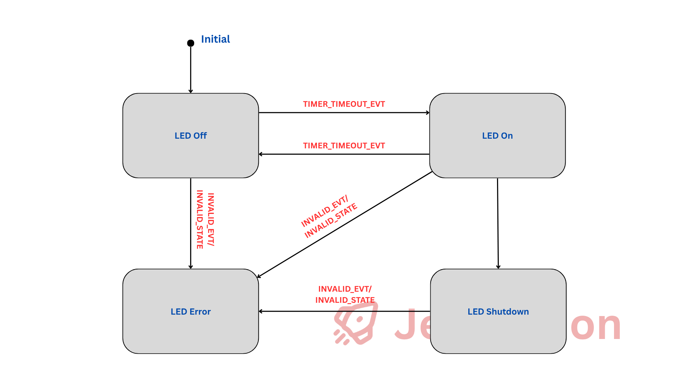
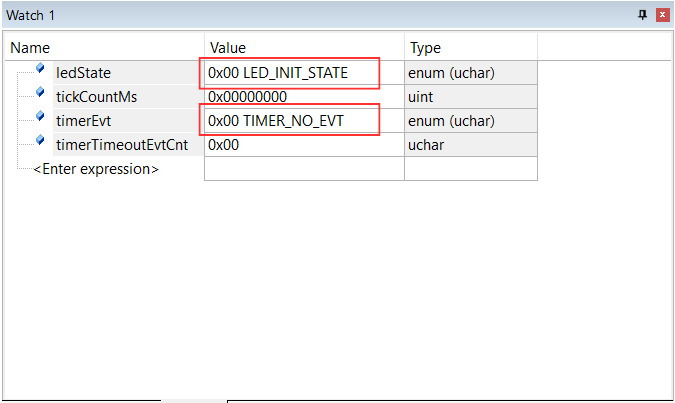

# Embedded C Enumerations

🎯 Enumerations (enums) are a fundamental feature in embedded C programming that provide type-safe constants, improve code readability, and help organize related values. In this comprehensive guide, I'll explore their usage, benefits, and best practices in embedded systems development.

## **What are Enumerations?**
💡 Enumerations are user-defined data types that consist of a set of named integer constants. They provide a way to assign names to integral constants, making code more readable and maintainable.

```c
typedef enum {
    GPIO_LOW  = 0U,
    GPIO_HIGH = 1U
} GpioState_t;
```

## Embedded C Enumerations Demo Project
🔑 In this demonstration, I will cover the following points:
- [x] How to define enumerations for different use cases
- [x] How to use enumerations with conditional statements
- [x] Practice using enumerations with a simple state machine
- [x] Tips and best practices when using enumerations

🔽 You can find the final source here: [Embedded C Enumerations Demo Project](Demo_Project/)
- 🔨 Development Boards: [STM32F103 Blue Pill Development Board](/README.md)
- 🔧 Tools: [Keil uVision](/README.md)

### Software Design
🎯 In this demonstration, I implement a state machine to perform state transitions based on the current state and timer events that occur, controlling the onboard LED.



⏰ Timer events are triggered by the value of the tick counter and the number of timeout events:
- `Timer timeout event` is triggered when a 1000 ms timeout elapses
- `Timer shutdown event` is triggered when the number of timer timeout events exceeds 20 times.

### Enumeration For GPIO State

#### Enumeration Definition
🔴 To turn the LED on and off, I need to provide the expected logical level for the LED GPIO pin. Normally, there are 2 logical levels we know for a GPIO pin: `HIGH` or `LOW`. Therefore, I define the enumeration as follows:

```C
typedef enum {
    GPIO_LOW  = 0U,
    GPIO_HIGH = 1U
} GpioState_et;
```

- In this definition, I explicitly assign values to the enum elements because the values `0U` and `1U` will be written to the register to determine whether the LED is on or off.
- I use the `typedef` keyword so that I don't need to repeat the `enum` keyword when declaring enum variables.

#### Enumeration Usage
- The function is defined to accept only `GpioState_et` values as a type-safe check to prevent incorrect usage. While you can pass an integer value (which will result in implicit type-casting or compiler warnings), this approach is not recommended.

    ```C
    void BSP_LedWrite(GpioState_et state) {
        /* Todo: Actual implementation */
        (void)state;
    }
    ```

- Now I can use the enum as a function parameter to turn the LED on/off without worrying about the actual numeric values, because the element names are self-explanatory and easy to understand.

    ```C
    void BSP_LedOff(void) {
        BSP_LedWrite(GPIO_LOW);
    }
    ```

    ```C
    void BSP_LedOn(void) {
        BSP_LedWrite(GPIO_HIGH);
    }
    ```

### Enumeration For Timer Values
#### Enumeration Definition
👉 Similarly, I define the enum values for the timer. In this demo, there are two important values that will determine the timer timeout duration:
- `Timer initial value` is `0U`
- `Timer timeout value` is `1000U`

```C
typedef enum {
	TIMER_INIT = 0U,
	TIMER_TIMEOUT_1000MS = 1000U
} TimerValue_et;
```
#### Enumeration Usage
👇 In this case, the enum can be used as a constant in the following cases:

- Declaration statement:

    ```C
    uint32_t tickCountMs = TIMER_INIT;
    ```

- Assignment statement:

    ```C
    tickCountMs = TIMER_INIT;
    ```

- Conditional statement:

    ```C
    /* Use TIMER_TIMEOUT_1000MS in if statement condition */
    if (tickCountMs >= TIMER_TIMEOUT_1000MS) {
        timerEvt = TIMER_TIMEOUT_EVT;
        timerTimeoutEvtCnt++;
        tickCountMs = TIMER_INIT;
    }
    else {
        /* do nothing */
    }
    ```

### Enumeration For Timer Events
#### Enumeration Definition
⏰ There are three enum values for timer events:
- `No timer event occurred` is `TIMER_NO_EVT`
- `Timer timeout event occurred` is `TIMER_TIMEOUT_EVT`
- `Timer shutdown event occurred` is `TIMER_SHUTDOWN_EVT`

```C
typedef enum {
	TIMER_NO_EVT,
	TIMER_TIMEOUT_EVT,
	TIMER_SHUTDOWN_EVT
} TimerEvent_et;
```

🔎 The notable aspect here is that I do not explicitly assign values to the enum elements. This is because the actual numeric values are not important for the software logic—the software only needs to identify which event occurred. 

👉 By default, the first element is initialized with `0U` and each subsequent element value is increased by 1.

#### Enumeration Usage
💡 Beyond the similar usage in declaration, assignment, and conditional statements, I would like to highlight a common practical application: `Safety Check` or `Guard Condition`. 

💡 In safety-critical systems, guard conditions ensure that the software validates whether received input is within the valid range before performing any processing. If validation fails, the system transitions to a safe state through established safety mechanisms.

```C
/* Event safety check before processing it */
if ((timerEvt >= TIMER_NO_EVT) && (timerEvt <= TIMER_SHUTDOWN_EVT)) {
    /* processing */
}
else {
    /* Invalid event => turn on notification */
    BSP_LedError();
    ledState = LED_ERROR_STATE;
}
```

### Enumeration For LED States
#### Enumeration Definition
👉 I organize and define the LED states as follows:
- `LED initial state` is `LED_INIT_STATE` - LED is initialized
- `LED run states` are `LED_OFF_STATE` and `LED_ON_STATE` - LED is being controlled
- `LED stop state` is `LED_STOP_STATE` - LED control is stopped
- `LED error state` is `LED_ERROR_STATE` - An error has occurred


```C
typedef enum {
	LED_INIT_STATE, 	/* Initial state 		*/
	LED_OFF_STATE, 		/* Running state - OFF	*/
	LED_ON_STATE, 		/* Running state - ON 	*/
	LED_STOP_STATE, 	/* Stop state 			*/
	LED_ERROR_STATE		/* Error state 			*/
} LedState_et;
```

👉 One benefit of using enums is that we can easily view both the numeric value and the symbolic name of enum variables in the debugger:



#### Enumeration Usage
🔑 Here's one of the most important applications of enums: using them as conditions in `switch` statements to implement state machines based on the current state and occurring events.

```C
switch (ledState) {
    case LED_OFF_STATE: {
        switch (timerEvt) {
            case TIMER_TIMEOUT_EVT: {
                BSP_LedOn();
                ledState = LED_ON_STATE;
                Timer_EventReset();
                break;
            }
            default: {
                break;
            }
        }
        break;
    /* other cases */
    }
    default: { /* invalid state => turn on notification */
        BSP_LedError();
        ledState = LED_ERROR_STATE;
        break;
    }
}
```

👉 The `switch` statement in C is well-suited for handling states that are predefined during the design phase.

👉 Unlike `if` statements that check for specific values or ranges, the `switch` statement is designed for conditions with a limited number of discrete cases—exactly where enums excel.

👉 Additionally, the `switch` statement includes a `default` case that developers can use to handle unexpected, invalid, or error conditions.

📣 I promise to spend time writing more about state machines, which is one of the most interesting topics in embedded software, in the future.

## Conclusion:
🔮 My experience with enumeration usage in real projects has been quite varied. However, enumerations are typically employed as part of thoughtful software design, where we carefully consider all possible states of an object, all potential events, or all values in a set of related information.

🚀 Enumerations are essential for writing maintainable, type-safe embedded C code. They provide excellent organization for constants, improve code readability, and help prevent common programming errors. When used properly with explicit sizing and validation, they're perfect for embedded systems development!

🔑 While using enumerations is beneficial, you should carefully consider the use cases where you apply them. In some situations, constants or macros may be better choices than enumerations, and vice versa. Additionally, for memory-constrained systems, exercise caution when using enumerations because they don't have an explicit data size—the size depends on the enum elements, the target controller, and compiler options.

# Beyond The Demo Project
🎓 Beyond my sharing in the demo project, you can refer to some additional information below about enumeration best practices. However, I recommend that you investigate and verify the correctness of this information for your specific use case. 👇

## Benefits in Embedded Programming

### Type Safety Benefits:
✅ **Compiler Type Checking** - Prevents assignment of invalid values  
✅ **Function Parameter Validation** - Catches wrong parameter types  
✅ **Switch Statement Coverage** - Compiler warns about missing cases  
✅ **Intellisense Support** - IDE autocompletion and suggestions  

### Code Quality:
✅ **Self-Documenting Code** - Names explain purpose clearly  
✅ **Namespace Organization** - Groups related constants  
✅ **Debugger Support** - Shows symbolic names instead of numbers  
✅ **Refactoring Safety** - Easy to change values globally  

### Maintenance Benefits:
✅ **Centralized Constants** - Single location for related values  
✅ **Automatic Value Assignment** - Sequential numbering  
✅ **Version Control Friendly** - Clear diff when values change  

## **Embedded-Specific Use Cases**
👉 There are a log of embedded specific use cases to use enumerations such as:
- Hardware State Management: GPIO Pin States, Communication Modes
- System States: Power Management States, Communication Protocol States
- Error Handling: Function Return Codes
- Interrupt Priorities: NVIC Priority Levels

## Memory Considerations

### Memory Usage
> [!WARNING]
Be careful with the size of enumeration because it's depend on the assigned values, microcontrollers and compliers.

```C
/* 1 byte enum type */
typedef enum {
    STATE_IDLE,
    STATE_RUNNING,
    STATE_ERROR
} SystemState_t;
```
```C
/* 2 bytes enum type */
typedef enum {
	TIMER_INIT = 0U,
	TIMER_TIMEOUT_1000MS = 1000U
} TimerValue_et;
```

### Storage Size Control
```c
/* Force specific size (GCC/Keil) */
typedef enum : uint8_t {
    SMALL_A = 0,
    SMALL_B = 1,
    SMALL_C = 2
} SmallEnum_t;  // Guaranteed 1 byte

/* Packed attribute for memory optimization */
typedef enum __attribute__((packed)) {
    TINY_X,
    TINY_Y,
    TINY_Z
} TinyEnum_t;   // Compiler chooses smallest suitable type
```

### Flash vs RAM Usage
💡 Enums are compile-time constants stored in flash, not RAM:

```c
/* This doesn't consume RAM */
typedef enum {
    CONFIG_TIMEOUT_MS = 1000,
    CONFIG_RETRY_COUNT = 3,
    CONFIG_BUFFER_SIZE = 256
} Config_t;

/* But variables do consume RAM */
Config_t current_timeout = CONFIG_TIMEOUT_MS;  // Uses RAM
```

## Best Practices for Embedded

### Explicit Value Assignment
```c
/* Good - Explicit values for hardware registers */
typedef enum {
    REG_CTRL   = 0x00,
    REG_STATUS = 0x01,
    REG_DATA   = 0x02
} RegisterAddr_t;

/* Good - Powers of 2 for bit flags */
typedef enum {
    FLAG_NONE    = 0x00,
    FLAG_ENABLE  = 0x01,
    FLAG_READY   = 0x02,
    FLAG_ERROR   = 0x04,
    FLAG_DONE    = 0x08
} StatusFlag_t;
```

### Naming Conventions
```c
/* Good - Clear prefixes and suffixes */
typedef enum {
    MOTOR_STATE_STOPPED,
    MOTOR_STATE_STARTING,
    MOTOR_STATE_RUNNING,
    MOTOR_STATE_STOPPING
} MotorState_t;

/* Good - Consistent naming pattern */
typedef enum {
    LED_RED_OFF,
    LED_RED_ON,
    LED_GREEN_OFF,
    LED_GREEN_ON
} LedControl_t;
```

### Default and Invalid Values
```c
/* Always include invalid/unknown states */
typedef enum {
    SENSOR_STATUS_UNKNOWN = 0,  // Default/reset state
    SENSOR_STATUS_OK      = 1,
    SENSOR_STATUS_WARNING = 2,
    SENSOR_STATUS_ERROR   = 3,
    SENSOR_STATUS_INVALID = 0xFF  // Out-of-range indicator
} SensorStatus_t;
```

## Common Pitfalls

### Size Assumptions
❌ Assuming enum size - Size is compiler/platform dependent
```c
/* Wrong - Don't assume size */
sizeof(MyEnum_t);  // Could be 1, 2, or 4 bytes

/* Right - Explicit size control */
typedef enum : uint8_t { ... } MyEnum_t;
```

### **Missing Switch Cases**
❌ Incomplete switch statements
```c
/* Wrong - Missing default case */
switch(state) {
    case STATE_IDLE: break;
    case STATE_RUNNING: break;
    // Missing STATE_ERROR case!
}
```

```C
/* Right - Always include default */
switch(state) {
    case STATE_IDLE: break;
    case STATE_RUNNING: break;
    case STATE_ERROR: break;
    default: 
        // Handle unexpected values
        error_handler();
        break;
}
```

### Type Safety Violations
❌ Mixing enum types
```C
/* Wrong - Mixing different enum types */
MotorState_t motor = LED_ON;  // Type mismatch
```

```C
/* Right - Use correct types */
MotorState_t motor = MOTOR_STATE_RUNNING;
```

### Invalid Runtime Values
❌ Unchecked runtime assignments
```c
/* Wrong - No validation */
SensorStatus_t status = (SensorStatus_t)received_byte;
```

```C
/* Right - Validate before assignment */
SensorStatus_t status;
if (received_byte <= SENSOR_STATUS_ERROR) {
    status = (SensorStatus_t)received_byte;
} else {
    status = SENSOR_STATUS_INVALID;
}
```

## Advanced Techniques

### Reset Enum Value
💡 Enumeration elements do not strictly to have different values. You can assign the value what everyou want.

💡 This technique provides clear separation and makes embedded system integration much more manageable!

```C
/* embedded system enum with reset values */
typedef enum {
    // Motor control states (0-9 range)
    MOTOR_STOPPED = 0,      // 0
    MOTOR_STARTING,         // 1
    MOTOR_RUNNING,          // 2
    MOTOR_STOPPING,         // 3
    MOTOR_FAULT,            // 4
    
    // Sensor error codes (100+ range for easy identification)
    SENSOR_OK = 100,        // 100 - Reset to sensor status range
    SENSOR_NOT_READY,       // 101
    SENSOR_TIMEOUT,         // 102
    SENSOR_CALIBRATION_ERR, // 103
    SENSOR_HARDWARE_FAULT,  // 104
} SystemStatus_t;
```

### Bit Field Enums
```c
/* Enum for bit positions */
typedef enum {
    CTRL_ENABLE_BIT  = 0,
    CTRL_RESET_BIT   = 1,
    CTRL_IRQ_BIT     = 2
} ControlBits_t;

/* Usage with bit manipulation */
#define SET_BIT(reg, bit)   ((reg) |= (1U << (bit)))
#define CLR_BIT(reg, bit)   ((reg) &= ~(1U << (bit)))

SET_BIT(control_reg, CTRL_ENABLE_BIT);
```

### Enum as Array Indices
```c
typedef enum {
    SENSOR_TEMP = 0,
    SENSOR_HUMIDITY = 1,
    SENSOR_PRESSURE = 2,
    SENSOR_COUNT  // Automatically gives array size
} SensorId_t;

/* Safe array indexing */
float sensor_values[SENSOR_COUNT];
sensor_values[SENSOR_TEMP] = 25.5f;
```

### State Machine Implementation
```c
typedef enum {
    FSM_INIT,
    FSM_IDLE,
    FSM_ACTIVE,
    FSM_ERROR,
    FSM_SHUTDOWN
} FsmState_t;

/* Function pointer table using enums */
typedef void (*StateHandler_t)(void);
StateHandler_t state_handlers[FSM_SHUTDOWN + 1] = {
    [FSM_INIT]     = init_handler,
    [FSM_IDLE]     = idle_handler,
    [FSM_ACTIVE]   = active_handler,
    [FSM_ERROR]    = error_handler,
    [FSM_SHUTDOWN] = shutdown_handler
};
```

## Folder structure
```
c-enumeration/                             # Main project directory
├── README.md                              # This documentation file
├── Demo_Project/                          # Complete STM32F103 demo project
│   ├── source/                            # Source code directory
│   │   ├── cfg/                           # Configuration files
│   │   ├── drv/                           # Hardware driver files
│   │   └── src/                           # Main application source code
│   └── uVision/                           # Keil uVision project files
└── imgs/                                  # Documentation images
```
# Explore More Topics
|[👈 Previous](/struct-union-data-types/README.md) | [Next 👉](/embedded-c-function/README.md)|

# Embedded C Practical Projects
🚀 [Embedded C Practical Projects](/)

# Repositories
🏠 [My Repositories](https://github.com/hothienai)

# My Website
🌐 [Ho Thien Ai](https://hothienai.github.io/)

# Contact & Discussion
If you have any thing would like to discuss or cooperate with me, please don't hesitate to contact me via:
- 📧 Email [Ho Thien Ai](mailto:thienaiho95@gmail.com)
- 💼 LinkedIn [Thien Ai Ho](https://www.linkedin.com/in/thien-ai-ho/)

