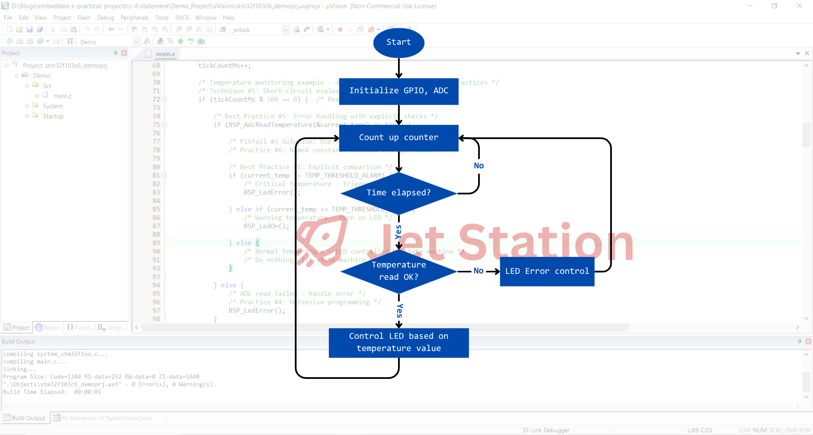

# Embedded C If Statements: Pitfalls, Best Practices & Special Techniques

🎯 If statements are the fundamental building blocks of decision-making in embedded C programming. However, their simplicity can be deceptive—numerous pitfalls await the unwary developer, especially in resource-constrained embedded systems. This comprehensive guide focuses on **critical pitfalls**, **proven best practices**, and **advanced techniques** to write robust, efficient if statements in embedded systems.

## **What Makes If Statements Critical in Embedded C?**
💡 Unlike desktop applications, embedded systems operate under strict constraints: limited memory, real-time requirements, hardware interactions, and safety-critical operations. A single incorrect if statement can lead to system crashes, hardware damage, or catastrophic failures. Understanding the pitfalls and mastering the techniques is **not optional—it's essential**.

```c
/* Simple if statement - but is it safe for embedded systems? */
if (sensor_reading > THRESHOLD_VALUE) {
    activate_alarm();
}
```

## Embedded C If Statements Demo Project
🔑 In this demonstration, I will cover the following critical aspects:
- [x] **Common pitfalls** that cause bugs in embedded systems
- [x] **Best practices** for writing safe and maintainable if statements
- [x] **Advanced techniques** for optimization and reliability
- [x] **Practical examples** from STM32 embedded development

> [!NOTE]
> This demonstration serves as a practical learning resource, though there's always room for improvement. After reading through the pitfalls, best practices, and advanced techniques documented below, I encourage you to identify areas that could be enhanced or additional scenarios that should be covered.

🔽 You can find the final source here: [Embedded C If Statements Demo Project](Demo_Project/)
- 🔨 Development Boards: [STM32F103 Blue Pill Development Board](/README.md)
- 🔧 Tools: [Keil uVision](/README.md)

### Software Design
🎯 In this demonstration, I implement a sensor monitoring and control system that showcases common if statement pitfalls and demonstrates best practices for embedded C programming.



⚠️ The system demonstrates:
- **Pitfall examples** - Common mistakes and their consequences
- **Best practice solutions** - Proper implementations
- **Performance optimization** - Efficient conditional logic
- **Safety-critical patterns** - Defensive programming techniques

## 🚨 Critical Pitfalls in Embedded If Statements

### Pitfall #1: Assignment vs Comparison (The Classic Trap)

**❌ THE PROBLEM:**
```c
/* WRONG - Assignment instead of comparison! */
uint8_t system_state = STATE_IDLE;

if (system_state = STATE_ERROR) {  /* BUG! This assigns, doesn't compare */
    trigger_emergency_shutdown();   /* This ALWAYS executes! */
}
```

**💥 CONSEQUENCES:**
- The condition always evaluates to true (non-zero value)
- Emergency shutdown triggers regardless of actual state
- In safety-critical systems, this could cause catastrophic failure
- Difficult to spot in code reviews

**✅ SOLUTIONS:**

**Solution 1: Standard comparison (Yoda conditions optional but helpful)**
```c
/* CORRECT - Proper comparison */
if (system_state == STATE_ERROR) {
    trigger_emergency_shutdown();
}

/* YODA STYLE - Prevents accidental assignment */
if (STATE_ERROR == system_state) {  /* Compiler error if you type '=' */
    trigger_emergency_shutdown();
}
```

**Solution 2: Enable compiler warnings**
```c
/* Many compilers warn about assignments in if conditions */
/* GCC/Clang: -Wparentheses */
/* MSVC: /W4 */
/* ARM Compiler: --remarks */

if (system_state = STATE_ERROR) {  /* Warning: suggest parentheses around assignment */
    trigger_emergency_shutdown();
}
```

### Pitfall #2: Integer Overflow/Underflow

**❌ THE PROBLEM:**
```c
/* WRONG - No overflow protection! */
uint8_t sensor_reading = 250;
uint8_t threshold = 10;

if (sensor_reading + threshold > 255) {  /* BUG! Overflow wraps to small value */
    handle_high_temperature();            /* Never executes! 250+10 = 4 (wrapped) */
}
```

**💥 CONSEQUENCES:**
- Arithmetic overflow causes wrap-around (250 + 10 = 4 on uint8_t)
- Safety checks fail silently
- Temperature protection never triggers
- Potential hardware damage

**✅ SOLUTIONS:**

**Solution 1: Check before arithmetic**
```c
/* CORRECT - Prevent overflow before it happens */
if (sensor_reading > (255 - threshold)) {  /* Check: 250 > 245 → TRUE */
    handle_high_temperature();
}
```

**Solution 2: Use wider types for intermediate calculations**
```c
/* CORRECT - Use larger type */
uint16_t sum = (uint16_t)sensor_reading + (uint16_t)threshold;
if (sum > 255) {
    handle_high_temperature();
}
```

**Solution 3: Safe addition function**
```c
/* BEST PRACTICE - Reusable safe addition */
bool safe_add_u8(uint8_t a, uint8_t b, uint8_t *result) {
    if (a > (UINT8_MAX - b)) {
        return false;  // Would overflow
    }
    *result = a + b;
    return true;
}

/* Usage */
uint8_t sum;
if (safe_add_u8(sensor_reading, threshold, &sum) && sum > 255) {
    handle_high_temperature();
}
```

### Pitfall #3: Floating-Point Comparison

**❌ THE PROBLEM:**
```c
/* WRONG - Direct float comparison! */
float sensor_temp = 25.3f;
float target_temp = 25.3f;

if (sensor_temp == target_temp) {  /* BUG! May fail due to precision errors */
    maintain_current_heating();     /* Unreliable execution */
}
```

**💥 CONSEQUENCES:**
- Floating-point arithmetic has rounding errors
- Direct equality checks are unreliable
- `0.1 + 0.2 != 0.3` in floating point
- Control loops become unstable

**✅ SOLUTIONS:**

**Solution 1: Epsilon comparison**
```c
/* CORRECT - Use tolerance-based comparison */
#define FLOAT_EPSILON 0.001f

bool float_equal(float a, float b, float epsilon) {
    return fabs(a - b) < epsilon;
}

if (float_equal(sensor_temp, target_temp, FLOAT_EPSILON)) {
    maintain_current_heating();
}
```

**Solution 2: Range checking**
```c
/* CORRECT - Check if within acceptable range */
#define TEMP_TOLERANCE 0.5f

if ((sensor_temp >= (target_temp - TEMP_TOLERANCE)) && 
    (sensor_temp <= (target_temp + TEMP_TOLERANCE))) {
    maintain_current_heating();
}
```

**Solution 3: Fixed-point arithmetic (preferred for embedded)**
```c
/* BEST PRACTICE - Avoid floats entirely */
typedef int16_t temp_t;  /* Temperature in 0.1°C units */

temp_t sensor_temp = 253;  /* 25.3°C */
temp_t target_temp = 253;  /* 25.3°C */

if (sensor_temp == target_temp) {  /* Exact integer comparison */
    maintain_current_heating();
}
```

## ✅ Best Practices for Embedded If Statements

### Practice #1: Explicit Boolean Comparisons

**Implicit vs Explicit:**
```c
/* IMPLICIT (less clear) */
if (error_flag) { ... }
if (!error_flag) { ... }
if (count) { ... }

/* EXPLICIT (more clear and safer) */
if (error_flag == true) { ... }
if (error_flag == false) { ... }
if (count != 0) { ... }
if (ptr != NULL) { ... }
```

**Why explicit is better:**
- Makes intent crystal clear
- Prevents confusion with assignment
- Easier for code reviews
- Better for safety-critical code

### Practice #2: Explicit Else In If Statements

**Always include explicit else clauses for complete coverage:**

**Why explicit else is critical in embedded systems:**
- Documents all possible paths through the code
- Prevents undefined behavior in unhandled cases
- Makes code review easier and safer
- Catches logic errors during development

**❌ BAD - Implicit handling:**
```c
/* DANGEROUS - What happens if sensor_status is neither READY nor ERROR? */
void process_sensor(uint8_t sensor_status) {
    if (sensor_status == SENSOR_READY) {
        read_sensor_data();
    }
    if (sensor_status == SENSOR_ERROR) {
        log_error("Sensor fault");
    }
    /* No explicit else - undefined behavior for other values! */
}
```

**✅ GOOD - Explicit else with default handling:**
```c
/* SAFE - All cases explicitly handled */
void process_sensor(uint8_t sensor_status) {
    if (sensor_status == SENSOR_READY) {
        read_sensor_data();
    } else if (sensor_status == SENSOR_ERROR) {
        log_error("Sensor fault");
        enter_safe_mode();
    } else {
        /* Explicit handling of unexpected values */
        log_error("Invalid sensor status: %d", sensor_status);
        enter_safe_mode();
    }
}
```

**State machine example with explicit defaults:**
```c
/* State machine with complete coverage */
void handle_communication_state(comm_state_t state) {
    if (state == COMM_IDLE) {
        /* Wait for connection */
        wait_for_connection();
    } else if (state == COMM_CONNECTED) {
        /* Process data */
        process_incoming_data();
    } else if (state == COMM_ERROR) {
        /* Handle error */
        reset_communication();
    } else {
        /* CRITICAL: Catch corrupted state variable */
        log_critical("Invalid comm state: %d", state);
        state = COMM_ERROR;  /* Force to known state */
        reset_communication();
    }
}
```

**Empty else with comment (when no action needed):**
```c
/* Even if no action is needed, make it explicit with comment */
void check_button(void) {
    if (button_pressed == true) {
        trigger_action();
        button_pressed = false;
    } else {
        /* No action needed - waiting for button press */
        /* Explicit else documents this is intentional */
    }
}
```

**Nested if statements with complete coverage:**
```c
/* BEST PRACTICE - All paths explicitly handled */
void process_adc_reading(uint16_t adc_value, bool calibrated) {
    if (calibrated == true) {
        if (adc_value > ADC_THRESHOLD_HIGH) {
            trigger_high_alarm();
        } else if (adc_value < ADC_THRESHOLD_LOW) {
            trigger_low_alarm();
        } else {
            /* Normal range - no action needed */
            adc_status = ADC_NORMAL;
        }
    } else {
        /* Not calibrated - cannot trust readings */
        log_warning("ADC not calibrated");
        adc_status = ADC_UNCALIBRATED;
    }
}
```

**Error-first pattern with explicit handling:**
```c
/* Check error conditions first, then normal path */
bool initialize_peripheral(peripheral_t *periph) {
    if (periph == NULL) {
        log_error("Null pointer");
        return false;
    } else if (periph->initialized == true) {
        log_warning("Already initialized");
        return true;  /* Not an error, but skip initialization */
    } else {
        /* Normal initialization path */
        periph->initialized = true;
        configure_peripheral(periph);
        return true;
    }
}
```

**Key principles:**
1. **Every if needs an else** - Even if it's empty with a comment
2. **Document intent** - Comments in empty else clauses explain why no action
3. **Safe defaults** - Else clauses should put system in safe state
4. **No implicit assumptions** - Don't assume "if not A, then B"

**When you can omit else:**
```c
/* Guard clause pattern - early return is acceptable */
bool validate_input(uint8_t value) {
    if (value > MAX_VALUE) {
        return false;  /* Early return - no else needed */
    }
    
    if (value < MIN_VALUE) {
        return false;  /* Early return - no else needed */
    }
    
    /* Implicit: value is in valid range */
    return true;
}
```

### Practice #3: Range Validation

**Always validate inputs:**
```c
/* BEST PRACTICE - Comprehensive input validation */
bool set_motor_speed(uint8_t speed_percent) {
    /* Range check */
    if (speed_percent > 100) {
        log_error("Invalid speed: %d", speed_percent);
        return false;
    }
    
    /* Safety check */
    if (emergency_stop_active == true) {
        log_warning("Emergency stop active");
        return false;
    }
    
    /* Hardware state check */
    if (motor_driver_ready() == false) {
        log_error("Motor driver not ready");
        return false;
    }
    
    /* All checks passed */
    motor_pwm_duty = speed_percent;
    return true;
}
```

### Practice #4: Defensive Programming

**Use assertions for impossible conditions:**
```c
#include <assert.h>

typedef enum {
    STATE_INIT,
    STATE_RUNNING,
    STATE_STOPPED
} system_state_t;

void handle_state_transition(system_state_t state) {
    if (state == STATE_INIT) {
        initialize_system();
    } else if (state == STATE_RUNNING) {
        run_system();
    } else if (state == STATE_STOPPED) {
        stop_system();
    } else {
        /* This should never happen */
        assert(0 && "Invalid state");  /* Catch in debug builds */
        safe_shutdown();                /* Safe recovery in release builds */
    }
}
```

### Practice #5: Error Handling Patterns

**Pattern 1: Error code return**
```c
typedef enum {
    ERR_OK = 0,
    ERR_INVALID_PARAM,
    ERR_TIMEOUT,
    ERR_HARDWARE_FAULT
} error_code_t;

error_code_t configure_sensor(sensor_config_t *config) {
    if (config == NULL) {
        return ERR_INVALID_PARAM;
    }
    
    if (config->sample_rate > MAX_SAMPLE_RATE) {
        return ERR_INVALID_PARAM;
    }
    
    if (sensor_init(config) == false) {
        return ERR_HARDWARE_FAULT;
    }
    
    return ERR_OK;
}

/* Usage */
error_code_t result = configure_sensor(&my_config);
if (result != ERR_OK) {
    handle_error(result);
}
```

**Pattern 2: Success flag with output parameter**
```c
bool read_temperature(int16_t *temp_out) {
    if (temp_out == NULL) {
        return false;
    }
    
    if (sensor_ready() == false) {
        return false;
    }
    
    *temp_out = sensor_read();
    return true;
}

/* Usage */
int16_t temperature;
if (read_temperature(&temperature) == true) {
    display_temperature(temperature);
} else {
    display_error();
}
```

### Practice #6: Magic Number Avoidance

**❌ BAD:**
```c
if (status == 0x42) {  /* What is 0x42? */
    trigger_calibration();
}

if (timeout > 5000) {  /* Why 5000? */
    reset_connection();
}
```

**✅ GOOD:**
```c
#define STATUS_CALIBRATION_REQUIRED  0x42
#define CONNECTION_TIMEOUT_MS        5000

if (status == STATUS_CALIBRATION_REQUIRED) {
    trigger_calibration();
}

if (timeout > CONNECTION_TIMEOUT_MS) {
    reset_connection();
}
```

## 🚀 Special Techniques for Performance & Safety

### Technique #1: Branch Prediction Hints

**For GCC/Clang compilers:**
```c
#define likely(x)    __builtin_expect(!!(x), 1)
#define unlikely(x)  __builtin_expect(!!(x), 0)

/* Hot path optimization */
void process_packet(packet_t *pkt) {
    /* Common case: valid packet */
    if (likely(pkt != NULL && pkt->valid)) {
        process_valid_packet(pkt);
    } 
    /* Rare case: error handling */
    else if (unlikely(pkt == NULL)) {
        log_error("Null packet");
    }
}
```

**Performance impact:**
- CPU pipelines optimize for predicted branch
- Reduces branch misprediction penalties
- 10-20% improvement in tight loops

### Technique #2: Bitfield Testing

**Fast bit manipulation:**
```c
/* Register bit definitions */
#define STATUS_READY_BIT    (1U << 0)
#define STATUS_ERROR_BIT    (1U << 1)
#define STATUS_BUSY_BIT     (1U << 2)

volatile uint32_t *STATUS_REG = (uint32_t*)0x40020000;

/* Efficient bit testing */
if ((*STATUS_REG & STATUS_READY_BIT) != 0) {
    start_transfer();
}

/* Multiple bit testing */
if ((*STATUS_REG & (STATUS_READY_BIT | STATUS_ERROR_BIT)) == STATUS_READY_BIT) {
    /* Ready and not error */
    start_transfer();
}

/* Atomic bit clear */
if ((*STATUS_REG & STATUS_BUSY_BIT) != 0) {
    *STATUS_REG &= ~STATUS_BUSY_BIT;  /* Clear busy bit */
}
```

### Technique #3: Compile-Time Optimization

**Static assertions for compile-time checks:**
```c
#include <assert.h>

/* Ensure buffer size is power of 2 for efficient modulo */
#define BUFFER_SIZE 256
_Static_assert((BUFFER_SIZE & (BUFFER_SIZE - 1)) == 0, 
               "Buffer size must be power of 2");

/* Ensure structure packing */
_Static_assert(sizeof(packet_header_t) == 16, 
               "Packet header size mismatch");

/* Range validation at compile time */
#define MAX_CHANNELS 16
#if MAX_CHANNELS > 32
    #error "MAX_CHANNELS cannot exceed 32"
#endif
```

### Technique #4: Const Correctness

**Prevent accidental modifications:**
```c
/* Read-only pointer parameter */
void display_config(const config_t *cfg) {
    if (cfg == NULL) return;
    
    cfg->param = 10;  /* Compiler error! const protection */
    
    if (cfg->mode == MODE_ACTIVE) {
        show_active_config(cfg);
    }
}

/* Const variables for safety */
void process_limits(void) {
    const uint16_t MAX_TEMP = 85;
    const uint16_t MIN_TEMP = -40;
    
    int16_t current_temp = read_temperature();
    
    MAX_TEMP = 100;  /* Compiler error! */
    
    if (current_temp > MAX_TEMP || current_temp < MIN_TEMP) {
        trigger_alarm();
    }
}
```

### Technique #5: Short-Circuit Evaluation

**Leverage operator order for optimization and safety:**

**Basic concept:**
```c
/* && operator: Right side evaluated ONLY if left is true */
if (ptr != NULL && ptr->data > 0) {
    /* Safe: ptr checked before dereferencing */
}

/* || operator: Right side evaluated ONLY if left is false */
if (error_flag || check_hardware_fault()) {
    /* Optimization: expensive check skipped if error_flag is true */
}
```

**Performance optimization:**
```c
/* ❌ INEFFICIENT - Always calls expensive function */
bool is_valid = is_pointer_valid(sensor) && read_sensor_status();

/* ✅ EFFICIENT - Cheap check first */
if (sensor != NULL && sensor->initialized && sensor_calibrated(sensor)) {
    /* Most expensive check (sensor_calibrated) only runs if others pass */
    process_sensor_data(sensor);
}
```

**Safety pattern with pointer validation:**
```c
/* BEST PRACTICE - Layered validation */
void update_sensor(sensor_t *sensor, uint16_t value) {
    /* Check in order: cheap to expensive, general to specific */
    if ((sensor != NULL) &&                    /* 1. Null check (fastest)       */
        (sensor->enabled) == true &&           /* 2. Simple flag check          */
        (value <= MAX_SENSOR_VALUE) &&         /* 3. Range validation           */
        (sensor_ready(sensor) == true)) {      /* 4. Hardware check (slowest)   */
        
        sensor->value = value;
    }
}
```

**Avoid side effects in short-circuit conditions:**
```c
/* ❌ WRONG - Side effect in condition is confusing and error-prone */
if ((retry_count++ < MAX_RETRIES) && connection_open()) {
    /* Unclear: Does retry_count increment before or after comparison? */
    /* What happens if connection_open() is never called? */
}

/* ✅ CORRECT - Side effects outside condition */
retry_count++;
if ((retry_count < MAX_RETRIES) && connection_open()) {
    /* Clear and predictable behavior */
}
```

**Embedded-specific optimization:**
```c
/* Optimize ADC reading with early exits */
bool read_adc_safe(uint16_t *result) {
    /* Fast checks first, expensive operations last */
    return (result != NULL) &&                           // Null check
           (ADC1->SR & ADC_SR_EOC) &&                   // Register check
           (*result = ADC1->DR, true) &&                // Read (side effect)
           (*result >= ADC_MIN && *result <= ADC_MAX);  // Validate range
}

/* Better approach - separate concerns */
bool read_adc_safe(uint16_t *result) {
    if (result == NULL) return false;
    if ((ADC1->SR & ADC_SR_EOC) == 0) return false;
    
    *result = ADC1->DR;
    
    if (*result < ADC_MIN || *result > ADC_MAX) return false;
    return true;
}
```

**Key principles:**
1. **Order matters** - Place cheap checks before expensive ones
2. **Null safety** - Always check pointers before dereferencing
3. **No side effects** - Avoid modifying state in conditions
4. **Fail fast** - Common failures should be detected early
5. **Readability** - Don't sacrifice clarity for minor gains

## 📊 Demo Project: Sensor Monitoring System

### Hardware Requirements
- **STM32F103C6 Blue Pill** development board
- **Temperature sensor** (simulated via ADC)
- **LED indicators** for status
- **Debug probe** (ST-Link V2)

### System Features

**Demonstrated Pitfalls:**
1. Pitfall #2: Integer overflow in ADC calculations (solution shown with wider types)
2. Pitfall #3: Floating-point comparison issues (solution: fixed-point arithmetic)

**Demonstrated Best Practices:**
1. Practice #1: Explicit boolean comparisons (`== true`, `== false`, `!= 0`)
2. Practice #3: Range validation (pointer checks, ADC range validation, temperature limits)
3. Practice #4: Defensive programming (timeout protection, error state handling)
4. Practice #5: Error handling patterns (return bool with output parameters)
5. Practice #6: Magic number elimination with named constants (`TEMP_THRESHOLD_HIGH`, `TEMP_THRESHOLD_ALARM`)

**Demonstrated Techniques:**
1. Technique #5: Short-circuit evaluation (null checks before dereference, flag checks before hardware access)

### Building and Running

```bash
# Clone repository
git clone https://github.com/yourusername/embedded-c-practical-projects.git
cd embedded-c-practical-projects/c-if-statement/Demo_Project

# Open in Keil uVision
# Build: Project -> Build Target (F7)
# Flash: Flash -> Download (F8)
# Debug: Debug -> Start/Stop Debug Session (Ctrl+F5)
```

## 📚 Summary

### Critical Takeaways

**🚨 Pitfalls to Avoid:**
1. **Assignment in conditions** - Use `==` not `=`, consider Yoda conditions
2. **Integer overflow** - Check before arithmetic, use wider types
3. **Float equality** - Use epsilon comparison or fixed-point arithmetic

**✅ Best Practices:**
1. **Explicit boolean comparisons** - `if (flag == true)` over `if (flag)`
2. **Explicit else clauses** - Always handle all paths, required by MISRA-C Rule 15.7
3. **Range validation** - Check ranges, nulls, and states for all inputs
4. **Defensive programming** - Use assertions for impossible conditions
5. **Error handling patterns** - Return error codes or success flags with output parameters
6. **Magic number avoidance** - Use named constants for all literal values

**🚀 Advanced Techniques:**
1. **Branch prediction hints** - `likely()` and `unlikely()` macros for GCC/Clang
2. **Bitfield testing** - Efficient bit manipulation for hardware registers
3. **Compile-time optimization** - Static assertions and preprocessor checks
4. **Const correctness** - Prevent accidental modifications with const qualifier
5. **Short-circuit evaluation** - Order conditions from cheap to expensive, safe before unsafe

### Resources
- [MISRA C Guidelines](https://www.misra.org.uk/)
- [CERT C Coding Standard](https://wiki.sei.cmu.edu/confluence/display/c/SEI+CERT+C+Coding+Standard)
- [STM32 Best Practices (AN4435)](https://www.st.com/resource/en/application_note/dm00095744.pdf)

---

💡 **Remember**: In embedded systems, a single if statement bug can cause system crashes, safety hazards, or data corruption. Always validate inputs, handle errors explicitly, and test edge cases thoroughly.

Happy coding! 🚀

## Folder Structure
```
c-if-statement/                            # Main project directory
├── README.md                              # This documentation file
├── Demo_Project/                          # Complete STM32F103 demo project
│   ├── source/                            # Source code directory
│   │   ├── cfg/                           # Configuration files
│   │   ├── drv/                           # Hardware driver files
│   │   └── src/                           # Main application source code
│   └── uVision/                           # Keil uVision project files
└── imgs/                                  # Documentation images
```

# Explore More Topics
|[👈 Previous](/c-enumeration/README.md) | [Next 👉](/c-inline-function/README.md)|

# Embedded C Practical Projects
🚀 [Embedded C Practical Projects](/)

# Repositories
🏠 [My Repositories](https://github.com/jet-studio)

# My Website
🌐 [Jet Station](https://jet-station.github.io/)

# Contact & Discussion
If you have anything you'd like to discuss or cooperate with me on, please don't hesitate to contact me via:
- 📧 Email [Ho Thien Ai](mailto:thienaiho95@gmail.com)
- 💼 LinkedIn [Thien Ai Ho](https://www.linkedin.com/in/thien-ai-ho/)

